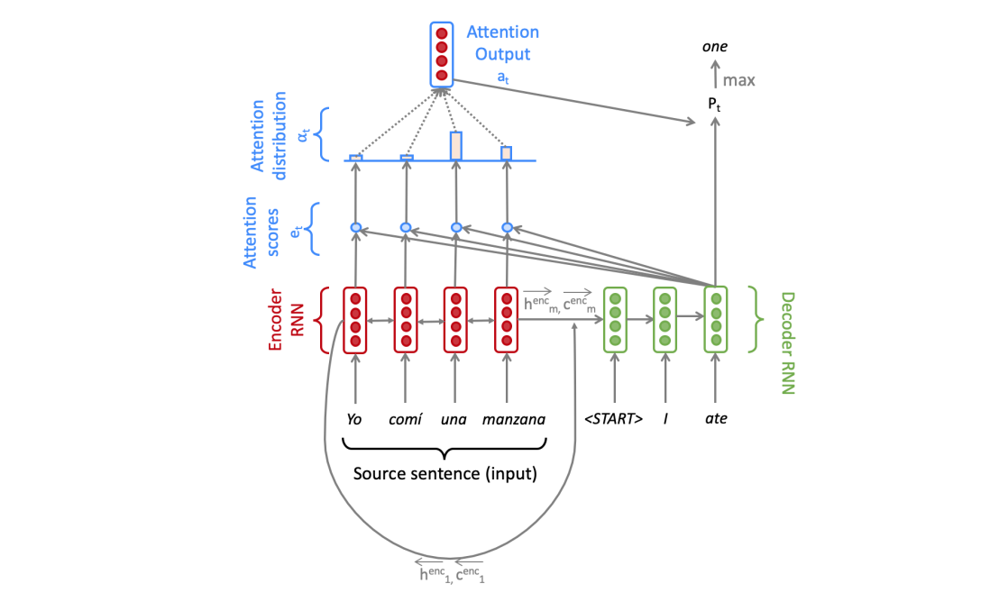

# Neural Machine Translation

This repository contains PyTorch implementation of a neural network model for machine translation. The code is heavily inspired from the Stanford course *CS224n Natural Language Processing with Deep Learning*.

The model architectures described in the following papers are followed closely:
 * [1] *Sequence to Sequence Learning with Neural Networks* by Sutskever et. al.
 * [2] *Neural Machine Translation by Jointly Learning to Align and Translate* by Bahdanau et. al.
 * [3] *Character-Aware Neural Language Models* by Kim et. al.
 * [4] *Effective Approaches to Attention-based Neural Machine Translation* by Luong et. al.

The model architecture uses a sequence-to-sequence network with attention. The encoder is a one-layer bidirectional LSTM network and the decoder is a one-layer unidirectional LSTM network. Both the encoder and the decoder have the same dimensionality of the hidden and cell states (*hidden_size*)

Model word embeddings are computed using a character-level CNN as described in [3]. A word is represented as a sequence of characters, and for each of these characters we lookup a dense character embedding vector. After that we use 1-dimensional convolutions to combine these characters. The kernel size essentially corresponds to the length of the n-gram the network learns to recognize. We take the maximum value, where the idea is to capture the most important feature. This way one filter of the CNN produces one feature. The number of filters corresponds to the dimension of the word embedding produced by the model. Finally we run the result through a highway network.

Additionally, an LSTM-based character-level decoder is added to the model as described in [4]. When the word-level decoder produces an *<UNK>* token, we run the character-level decoder to instead generate the target word one character at a time.

The following modules are implemented:
 * `vocab.py` implements a vocabulary object for the language model.
 * `model_embeddings.py` implements a character-based CNN model for computing word embeddings.
 * `char_decoder.py` implements a character-level decoder for genereting out-of-vocabulary words.
 * `nmt_model.py` implements a neural machine translation model using sequence-to-sequence with attention architecture and ties together the previous modules.